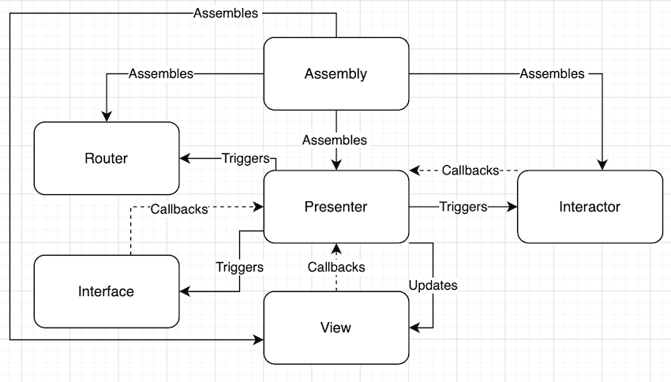

# +Babbel

A take-home project - Word Game.

Each milestone is available as a separate release (see Releases).

**Non-functional requirements:**
- Minimum Deployment Target: iOS14.1 (https://developer.apple.com/support/app-store/)
- Support for iPad: Yes

**Functional requirements:**
- Support for Landscape mode: Yes
- Dark theme: Yes
- Localization: No
- Persistence: No
- Offline: Yes
- AppIcon: No
- Haptics: No

**Project decisions:**
- Architecture: VIPER
- Linting/Formating: No
- CI (GitHub Actions): NO
- Modularization: No
- External dependencies: No
- Unit tests: Yes
- UI test: No
- Storyboard/Xib: No

**Project structure (some more or less obvious parts are skipped):**
- AppCore: Application level protocols/tools/extension etc. If the application was modularized, this would go to one or multiple core frameworks.
- - Views: Application level views that would constitute a design system. Each view has a Style and a ViewData. Style is what the view looks like, ViewData is what the view displays and callbacks.
- Screen: These are all different screens of the applications, each one is implemented using VIPER architecture.
- - WordGame: Screen of the main game (there could be more games in the future).
- - - Assembly: Entity that composes the screen, knows about all other parts of the screen, returns screen interfaces and UIViewController.s
- - - Interactor: Entity that contains business logic. Uses services, and doesn’t know about anything else. 
- - - Presenter: Entity that contains glue logic between business logic and view. Knows about interactor, view and router. Receives callbacks from view, triggers business logic in the interactor, converts models to ViewModels, updates view, subscribes to interactor events.
- - - View: Entity that contains UIView/UIViewController. Doesn’t know about anything.
- - - Router: Entity that contains routing logic. Doesn’t know about anything except for assemblies it uses.
- - - Interfaces: Screen interface for interscreen communication.
- - - Service:  Entity that contains reusable business logic, e.g. network access, file system access, other logic. Used by interactors.

**VIPER Architecture:**
  

**Code decision**:
- Everything is hidden behind a protocol (Dependency Inversion Principle), so that it can be mocked/stubbed during testing. 
- There are several general purpose views (ButtonView, LabelView), their appearance can be configured with a style (style can be declared once and used multiple times), their contents can be set with a view data. 
- Word list loading logic is implemented in such a way, that neither word list filename, nor word/translation keys in the file are hardcoded. Same logic can be reused for any language, no matter filename, location or keys in the file (see FileSystemWordPairsProvider)
- Word pairs are generated as an infinite lazy sequence, so that the game would never end, until desired by the user and no computation happens eagerly. Probability of a correct word pair is guaranteed to be the one requested, e.g ¼, ½, ⅕ etc. This is also tested. 
(see WordPairAnswersGeneratorImpl(Tests)).

**TODOs:**
- Error handling
- Better code coverage (UI/Unit tests)
- Get rid of warning that appears after increasing Minimum Deployment Target
- Snapshot tests for all device sizes
- Haptics for better UX
- AppIcon
- Code linting/formating
- Configure linting/formatting/testing through GitHub actions
- Dependency Manager (DI)

**Known issues:**
- In flight animation doesn't update when the device is rotated, the next one is fine though.
- Correct / Wrong buttons do not update their border and shadow colors when Dark Mode is turned on/off while the app is open.

**Time spent:**  
About half an hour or so was spent examining PDF.  
Next hour or so I dedicated myself to research, project related decisions and requirements.  
Next 4-5 hours were spent to make sure to accomplish the first milestone, solid architecture, project structure, etc.  
Next 6-8 hours were spent to accomplish second and third milestones, write tests, prepare for submissions and write down this documentation.  
